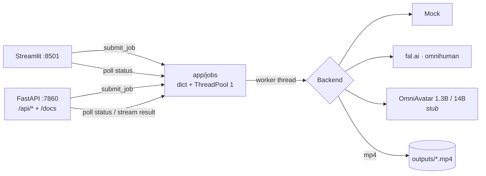

# Avatar Studio

Talking-avatar video generation demo: image + audio + prompt → video.

🌐 **Online demo:** https://avatar-studio-production-cc26.up.railway.app/

## Architecture



Both the Streamlit UI and the REST API call into the same `app/jobs` module —
one queue, one worker, one source of truth.

## Quick Start

Docker:
```bash
cp .env.example .env
docker compose up --build
```

Local (conda):
```bash
conda create -n avatar-studio python=3.11 -y
conda activate avatar-studio
pip install -r requirements.txt
copy .env.example .env
streamlit run app/main.py
```

- UI: http://localhost:8501
- Swagger / OpenAPI: http://localhost:7860/docs
- Empty `FAL_API_KEY` → mock backend (offline, returns a cached sample video).

## REST API

| Method | Endpoint | Description |
|---|---|---|
| `POST` | `/api/jobs` | Submit a job → `{"job_id"}` |
| `GET`  | `/api/jobs` | List all jobs (newest first) |
| `GET`  | `/api/jobs/{id}` | Get `Job` status |
| `GET`  | `/api/jobs/{id}/result` | Download mp4 (404 until `done`) |

`POST` form: `image`, `audio` (files), `prompt`, `mode`, `num_steps`, `guidance_scale`, `audio_scale`.
`mode` ∈ `mock` · `fal` · `OmniAvatar 1.3B` · `OmniAvatar 14B` · `auto`. Tunable params apply to OmniAvatar only (`20–50`, `1.0–10.0`, `1.0–5.0`).

<details>
<summary><code>Job</code> object</summary>

```json
{
  "id": "a1b2c3d4...",
  "status": "running",
  "progress": 47.5,
  "message": "mock step 9/20",
  "prompt": "friendly, smiling",
  "mode": "mock",
  "params": {"num_steps": 30, "guidance_scale": 5.0, "audio_scale": 3.0},
  "error": null,
  "created_at": "2026-05-25T12:34:56",
  "started_at": "2026-05-25T12:34:57",
  "finished_at": null,
  "elapsed_seconds": null,
  "result_url": "/api/jobs/a1b2c3d4.../result"
}
```
`status`: `queued` → `running` → `done` \| `failed`. `result_url` is `null` until `done`.
</details>

<details>
<summary>Curl walkthrough</summary>

```bash
curl -X POST :7860/api/jobs -F image=@a.jpg -F audio=@b.mp3 -F mode=fal
curl    :7860/api/jobs/<job_id>
curl -O :7860/api/jobs/<job_id>/result
```
</details>

Try-it-out + full schema → [`/docs`](http://localhost:7860/docs)

## Checklist

**Frontend**
- [x] Форма загрузки: reference image, аудио, текстовый промпт поведения
- [x] Real-time прогресс генерации (не polling)
- [x] Просмотр и скачивание результата
- [x] Обработка ошибок с понятной обратной связью

**Backend**
- [x] API для приёма задач и получения статуса/результата
- [x] Очередь задач с балансировкой (корректная работа при параллельных запросах)
- [x] GPU-воркер с интеграцией OmniAvatar inference pipeline — *структурный stub: `download_omniavatar_weights() / load_omniavatar_pipeline() / run_omniavatar()` в [app/inference.py](app/inference.py) с подробным docstring'ом «что заменить на Stage 2». Сейчас run_omniavatar() падает на mock fallback.*
- [x] Валидация входных файлов

**Инфраструктура**
- [x] Docker Compose — всё поднимается одной командой
- [x] README с инструкцией по запуску, описанием архитектуры и обоснованием решений

**Плюсом**
- [x] Галерея / история генераций
- [x] Выбор модели (14B / 1.3B) и параметров в UI
- [ ] TTS — генерация аудио из текста вместо загрузки файла
- [x] Превью входных данных перед отправкой
- [x] API-документация (Swagger)
- [ ] Мониторинг, логирование, тесты
